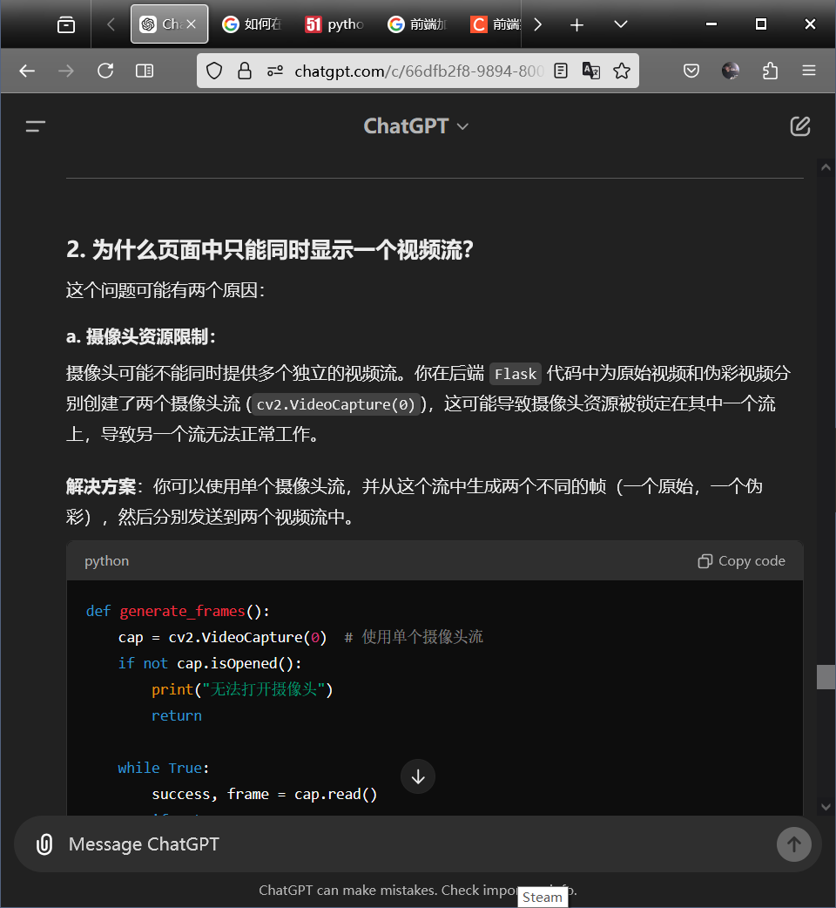

# 基于Python Web的燃烧状态诊断系统
本项目是一个基于Python Web的燃烧状态诊断系统，通过摄像头实时监控火焰燃烧状态，通过视频处理技术提取火焰的特征参数，如燃烧信号、稳定性、温度等，实现对火焰燃烧状态的实时监控和诊断，最后实现了前端界面。
# 过程
### 9.2
- 选题
### 9.3
- 整理大致思路，初步学习，明确分工与功能
### 9.4
- 完成了后端的视频处理功能，使用applyColorMap生成伪彩映射，并给出了简单的html前端界面
  - index、generate_pseudocolor_frames、generate_original_frames、video_feed_pseudocolor、video_feed_original
- 添加用户认证界面
  - register、login、logout、load_user
- 数组数据存储在文本文件、JSON文件或二进制文件
- 使用css调整前端样式
### 9.5
- 对界面使用JS进行美化
  - 增加密码强度，密码确认
- 打包成exe文件
### 9.9
- 将加载视频改为调用摄像头加载实时视频流
### 9.23
- 添加了OBS的虚拟摄像头调用，在OBS运行时可以调用OBS摄像头来加载视频流，在本次实训没有摄像头和真实火焰燃烧的情况下，模拟监控火焰画面
- 添加了录制功能
  - toggle_recording
- 添加火焰参数计算和显示功能
  - calculate_flame_properties、get_flame_properties
  - 假设火焰面积的变化反映了燃烧信号和稳定性,假设火焰的亮度代表温度
  ```
      转化为灰度图像gray = cv2.cvtColor(frame, cv2.COLOR_BGR2GRAY)\
      二值化处理，用于分割火焰_, binary = cv2.threshold(gray, 200, 255, cv2.THRESH_BINARY)\
      计算火焰轮廓contours, _ = cv2.findContours(binary, cv2.RETR_EXTERNAL, cv2.CHAIN_APPROX_SIMPLE)\
      计算火焰边界x, y, w, h = cv2.boundingRect(largest_contour)\
      燃烧信号flame_signal = min(100, flame_area / (gray.shape[0] * gray.shape[1]) * 100)\
      稳定性flame_stability = min(100, 100 - np.std(gray[y:y+h, x:x+w]) / 255 * 100)\
      计算平均亮度average_temp = np.mean(gray[y:y+h, x:x+w])\
  ```
- 添加上述两个功能后，重写CSS，优化HTMl界面

# TODO
* 重复生成同一路径的问题
  * 通过一层一层print变量调试解决了
* 网站生成有问题，是缺少了favicon.ico文件
* ~~每次注册后的用户不会保存，下次启动程序需要重新注册~~
  * 将用户信息保存到json文件中并读取，同时也修改了相应变量--9.5
* 注册界面可以把Email删掉
* exe上传与处理文件生成的路径出错了
* 尝试转换成vue框架The method is not allowed for the requested URL.
* 在同时呈现原视频帧和处理帧的时候出现了竞争摄像头资源的问题
  * 尝试用两个函数处理两个视频流
  * 尝试一个函数返回两个视频流
  * 
# 收获
* 学习到了CSS,HTML,JS的基本知识
  * HTML是用来创建页面结构的，css是用来给页面添加样式的，js是用来给页面添加交互性的。当然，你可以将css和js包含在html中，但不推荐这样做。
# 遇到的问题
**Flask:**\
* The method is not allowed for the requested URL.\
* 405 Method Not Allowed\

**Python:**\
* json.loads(),Read JSON file using Python\
* How to do Python or Flask Debug\
* Jetbrains IDE Plugin Installation Error java.nio.file.AccessDeniedException: https://blog.csdn.net/u014414331/article/details/140446188\
* 'list' object has no attribute 'get'\
* python global\
* https://stackoverflow.com/questions/68923157/call-obsstudio-virtual-camera-in-python\

**Web:**\
* Stream video from OpenCV to Web Browser\
* https://github.com/pornpasok/opencv-stream-video-to-web\
* 前端实现播放实时监控视频笔记(hls http-flv)https://blog.csdn.net/u012961419/article/details/120491439\
* 一样的脚本放在html中就有用，但是单独放在js文件中就失效了，怀疑是参数传递的问题\
* 还有是否添加defer也会对脚本渲染有影响
